# Homework: GIF Finder

<!--- Local Navigation --->
I. [Overview](#section1)

II. [Web Service Terms](#section2)

III. [Get Started](#section3)

IV. [Capture the user intent and format a URL](#section4)

V. [Testing the URL](#section5)

VI. [Utilizing `XMLHttpRequest`](#section6)

VII. [Downloading the data with `XHR`](#section7)

VIII. [Formatting the results for the user](#section8)

IX. [Wrap up](#section9)

X. [Homework Assignment](#section10)

<hr>

## <a id="section1">I. Overview
- *GIF Finder* will utilize the Giphy **web service** to search for GIFs based on keywords, and then display the results to the user.
- **What is a Web Service?**  *A Web service is a method of communication between two electronic devices over World Wide Web. A Web service is a software function provided at a network address over the web or the cloud; it is a service that is "always on" ...* - http://en.wikipedia.org/wiki/Web_service
- The documentation for the Giphy Web Service is here: https://developers.giphy.com/docs/
- A summary of what this app will do:
  1. The user will type in a search term and hit return.
  1. The app will create a properly formatted URL (that includes the search term) that points at the web service.
  1. The app will send a request to download the file located at that URL.
  1. A few seconds later the response (a file) will be downloaded by the web browser.
  1. The downloaded file is in the JSON (JavaScript Object Notation) format - it's basically an object literal with just data, no methods.
  1. The app will parse the JSON data and display the results to the user.
  
  
**Note: If you have not done so yet, please be sure to look over the [10 - Web Services](web-apps-10.md) chapter.**

### Screen Shots

#### Starting State:
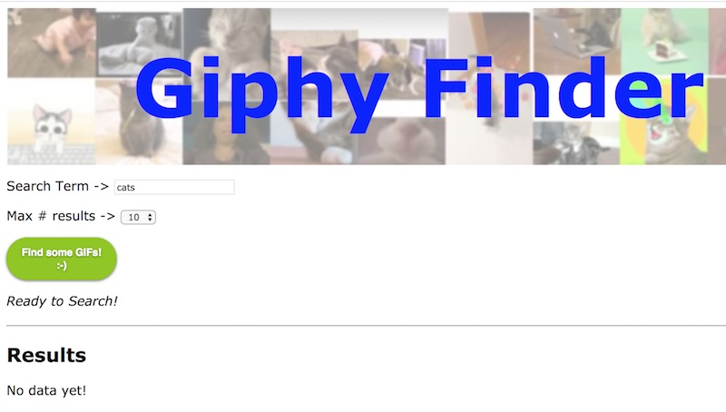

<hr><hr>

#### And after the user has made a search:
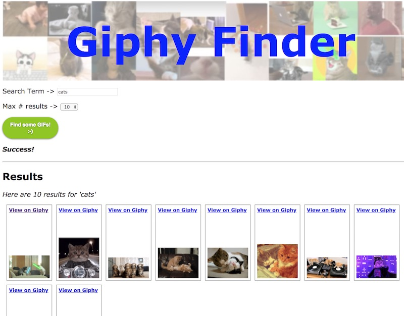

<hr><hr>

## II. <a id="section2">Web Service Terms

1. Web Service - http://en.wikipedia.org/wiki/Web_service - A Web service is a method of communication between two electronic devices over World Wide Web. A Web service is a software function provided at a network address over the web or the cloud; it is a service that is "always on" ...
2. API - http://en.wikipedia.org/wiki/Api - An application programming interface (API) specifies how some software components should interact with each other.
3. Query String - http://en.wikipedia.org/wiki/Query_string - In the World Wide Web, a query string is the part of a uniform resource locator (URL) that contains data to be passed to web applications such as CGI programs.
4. Arguments (or parameters) - http://en.wikipedia.org/wiki/Parameters_(computer_science) - In computer programming, a parameter is a special kind of variable, used in a subroutine to refer to one of the pieces of data provided as input to the subroutine.
5. API Key - http://en.wikipedia.org/wiki/API_key - An application programming interface key (API key) is a code passed in by computer programs calling an API (application programming interface) to identify the calling program, its developer, or its user to the Web site. API keys are used to track and control how the API is being used, for example to prevent malicious use or abuse of the API (as defined perhaps by terms of service).

## III. <a id="section3">Get Started

- Below is your starting file with the HTML and CSS all done for you. 
- You can name the file **gif-finder.html**
- You will also need these images --> [gif-finder-start-files.zip](_files/gif-finder-start-files.zip)

### gif-finder.html

```html
<!DOCTYPE html>
<html lang="en">
<head>
	<meta charset="utf-8" />
 	<title>Giphy Finder</title>
 	<style>
		*{
			font-family:verdana,tahoma,sans-serif;
		}
	
 		header{
 			background: url(images/cats.jpg);
 			height:195px;
 		}
 		
 		header h1{
 			margin:0;
 			color:blue;
 			text-align:center;
 			font-size:100px;
 			padding-top: 35px;
 		}
 		
 		#status{
 			font-style: italic;
 			height:32px;
 		}
 		
 		.result {
			position: relative;
			height: 175px;
			width: 100px;
			float:left;
			border:1px solid gray;
			padding:5px;
			margin-left:10px;
			margin-bottom:10px;
		}

		.result img {
			position: absolute;
			left: 5px;
			bottom: 5px;
			display:block;
			
		}
		
		.result span{
			font-size:12px;
			font-weight:bold;
			display:block;
		}
		
		.result audio{
			width: 130px;
		}
		
		button{
		  display : inline-block;
		  cursor : pointer;
  
		  border-style : solid;
		  border-width : 1px;
		  border-radius : 50px;
		  padding : 10px 18px;
		  box-shadow : 0 1px 4px rgba(0,0,0,.6);
		  font-size : 9.5pt;
		  font-weight : bold;
		  color : #fff;
		  text-shadow : 0 1px 3px rgba(0,0,0,.4);
		  font-family : sans-serif;
		  text-decoration : none;
		}
		
		button.green{
			border-color: #8fc800;
	  		background: #8fc800;
	  		background: linear-gradient(top, #8fc800 0%,#438c00 100%);
		}
		
		button:hover{
			background: #8fDD00;
		}
		
		button:active{
			background: #8fFF00;
			box-shadow : 0 0 6px rgba(0,0,0,.6);
		}
		
		button:focus {outline:0;}
		
		.widgets{
			margin-top: 1em;
			margin-bottom:1em;
		}
		
 	</style>

  <script>
    // 1
  	window.onload = (e) => {document.querySelector("#search").onclick = searchButtonClicked};
	
	// 2
	let displayTerm = "";
	
	// 3
	function searchButtonClicked(){
		console.log("searchButtonClicked() called");
		
	}
	
  </script>

  
</head>
<body>
<header>
	<h1>Giphy Finder</h1>
</header>

<div class="widgets">
	Search Term -> 
	<input id="searchterm" type="text" size="20" maxlength="20" autofocus value="cats" />
</div>

<div class="widgets">
	Max # results -> 
	<select id="limit">
		<option value="5">5</option>
		<option value="10" selected>10</option>
		<option value="25">25</option>
		<option value="50">50</option>
		<option value="100">100</option>
	</select>
</div>

<div class="widgets">
	<button type="button" id="search" class="green">Find some GIFs!<br />:-)</button>
</div>
<div id="status">Ready to Search!</div>
<hr>

<h2>Results</h2>
<div id="content">
	<p>No data yet!</p>
</div>
 

</body>
</html>
```


### A. Explanation
- In #1 above - we are hooking up a button event handler in the `window.onload` event. Note we have wrapped the code in an arrow function - we also could have used a regular function - it doesn't matter either way.
- In #2 above - this will store what the user searched for, we need it to be in script scope so that we can access it from outside of our  `searchButtonClicked()` function.
- In #3 above - `searchButtonClicked()` will be called when the button is clicked.

- ***Load the page into your browser*** - the background image behind the text should be visible.
- ***Test the code by clicking the button*** - and then check the console for the `"searchButtonClicked() called"` log.


## IV. <a id="section4">Capture the user intent and format a URL
We need to write code to build a URL to the web service. This URL will contain the user's search preferences (search term and number of results).

**Type this code in:**

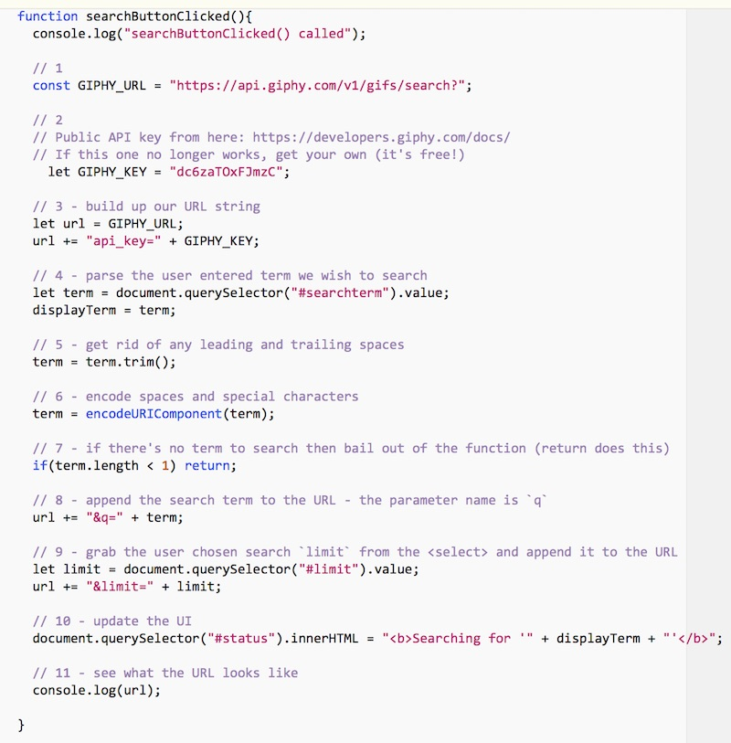

### A. Explanation (*Read this! Don't just type in the code without understanding it!*)
- #1 above - this URL is the Giphy *Search endpoint*. Here's an example of another endpoint, the Giphy "Trending" endpoint: `https://api.giphy.com/v1/gifs/trending`
- #2 above - this API key identifies you to the owner of the service. API keys are used to track and control how the API is being used - so if the user of this key is abusing the service it can be "turned off". This particular key is a public key and may no longer work when you do the exercise. If it does not, head here to get your own key (it's free!): https://developers.giphy.com/docs/
- #3 above - we specify a parameter - `api_key` - and then give it a value
- #4 above - get the `.value` of the text input field
- #5 above - get rid of leading and trailing spaces. URLs do not work with spaces! Read about `String.trim()` here: https://developer.mozilla.org/en-US/docs/Web/JavaScript/Reference/Global_Objects/String/Trim
- #6 above - `encodeURIComponent()` will escape characters like spaces (because we still might have spaces in the middle of the search term), ampersands, $ signs, + symbols and so on so that they are properly represented for a URL. For example, a space becomes `%20`. You can read the docs here: https://developer.mozilla.org/en-US/docs/Web/JavaScript/Reference/Global_Objects/encodeURIComponent
- #7 above - bail out if we have nothing to search for
- #8 above - add the search term to the url - the web service requires this parameter name to be `q`
- #9 above - grab the value of the &lt;select>, and then add the `limit` parameter to the url. Note that parameters are formated as `name=value` and separated by ampersands.
- #10 above - update the UI with the user's search term
- #11 above - finally! log out the URL

## V. <a id="section5">Testing the URL

- Run the code and click the button. Now head to the console and you should see the complete URL to the web service. 
- Think of this URL as being like calling a function and expecting to get a value back, except in this case the function resides on a remote server. 
  - Another difference is that when you call a function in your code, you pass arguments like this `doStuff(arg1,arg2,arg3)`
  - With a web service, you pass arguments in the *query string* like this `http://www.sample.com/doStuff?arg1=stuff&arg2=moreStuff&arg3=evenMoreStuff`
- Now click on the completed URL in the console, it should open a new browser window that will show you the results of the Giphy API request. (If nothing happens, check that your code is correct, and/or copy/paste the URL to a browser location box)

### A. After clicking the search button, you should see the URL in the console


### B. Clicking on the link opens a web page that shows the JSON response to your search. 

- You can see that you are getting back a JS Object literal, and there is a top-level property named `data` that contains an array of objects. Each of these objects represents a animated GIF on Giphy - note some of the properties that will come in handy: `url`, `rating`, `width`, `height` and so on.

- If your JSON isn't as nicely formatted as mine, it's because I am using the Chrome JSON Viewer extension which you can get here: https://chrome.google.com/webstore/detail/json-viewer/gbmdgpbipfallnflgajpaliibnhdgobh


### C. Modify the URL in the location box

Below we changed the `q` parameter to `dogs` and the `limit` parameter to `2` - you can see we received a different JSON file from the server!


### D. Modify the API key value
If you do that, oops, you will probably get an error message (unless it is a valid API key)


### E. Check out the HTTP Response Headers that the web service sent

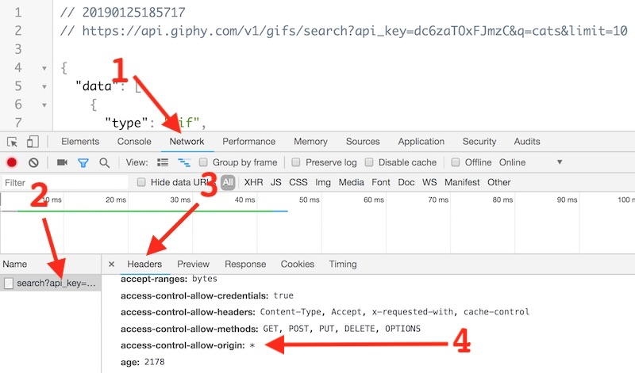

- You can see these by opening the Chrome web inspector and:
  - #1 --> Select the **Network** tab (and then reload the page)
  - #2 --> Click on the file name on the left
  - #3 --> Click on the **Headers** tab
  
- #4 --> See the `access-control-allow-origin: *` header? 
  - This header means that a web browser from *any* domain (indicated by `*`) is allowed to download the data
  - This is the header we like to see, because it means that our JavaScript app will definitely be able to get the data
  - When you are working on your web service project, ideally your chosen web service has this turned on
  

## VI. <a id="section6">Utilizing XMLHTTPRequest
	
- To download the data, we are going to utilize the `XMLHTTPRequest` API (also known as **XHR**)
- You can read about this API here: https://developer.mozilla.org/en-US/docs/Web/API/XMLHttpRequest
- What MDN says --> *"Use XMLHttpRequest (XHR) objects to interact with servers. You can retrieve data from a URL without having to do a full page refresh. This enables a Web page to update just part of a page without disrupting what the user is doing. XMLHttpRequest is used heavily in AJAX programming."*


## VII. <a id="section7">Downloading the data with `XHR`

### A. Now we are going to tell `XHR` to download the data from the URL we assembled above

**Add this code to the bottom of `searchButtonClicked()`:**

```js
// 12 Request data!
getData(url);
```

**Here is the implementation of `getData()`:** - place this code *outside* of `searchButtonClicked()`:**

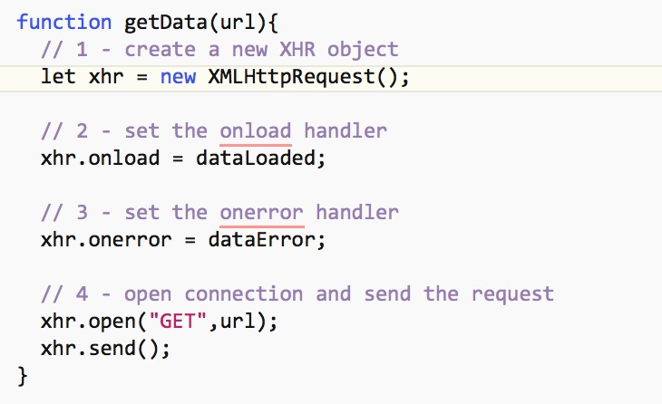


### B. Create the callback functions
**Below are the two callback functions - place this code *outside* of `getData()` and `searchButtonClicked()`:**

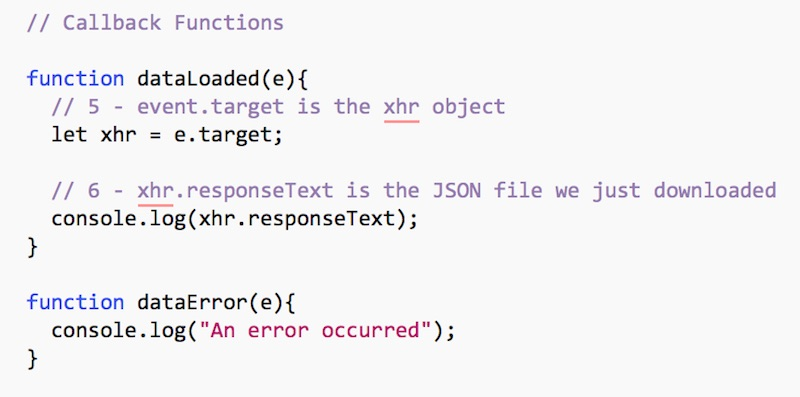

### C. Explanation
- #1 above - we create a new XHR object
- #2 - set the `onload` handler - this is called when the data is successfully loaded
- #3 - set the `onerror` handler - this is called when some errors occur
- #4 - open the connection and send the request. "GET" is the HTTP *method* we are using - it means that we are sending web service parameters in the *query string* (part of the URL) and not as a separate file (which is what the "PUT" method is)
- #5 - after the data has loaded, get a reference back to the XHR object
- #6 - log out the JSON file we have downloaded

### D. Run the app and click the search button 

You should see the JSON we downloaded in the console:

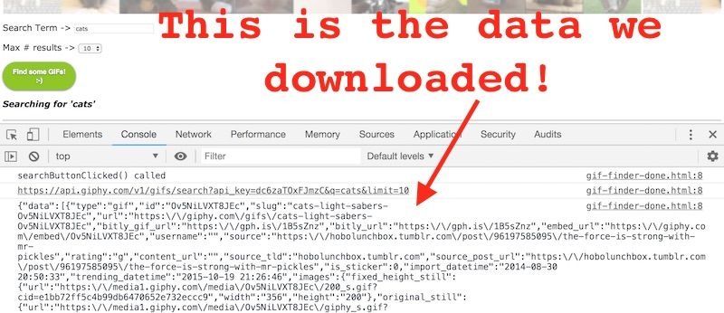

## VIII. <a id="section8">Formatting the results for the user

Now we just need to take the results, loop through them, and create some HTML. Here's the code you need to add to `dataLoaded()`:

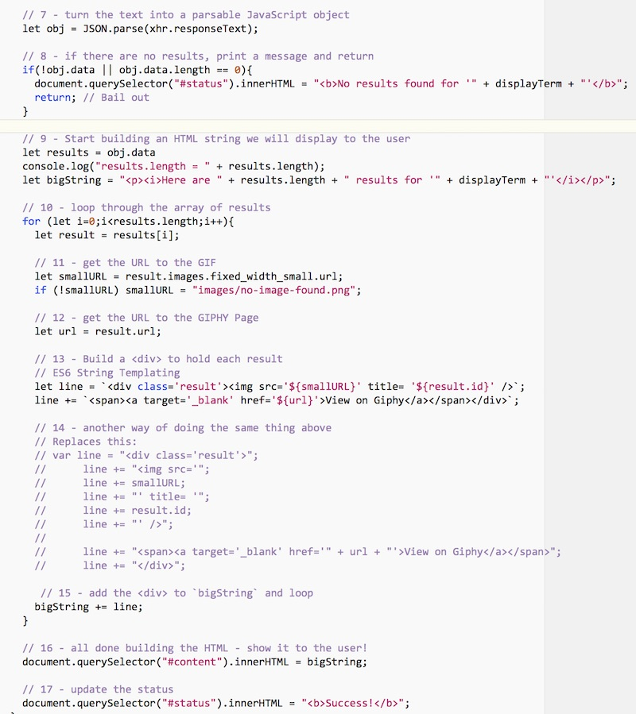

Go ahead and run the code, the app should pretty much look like the second screenshot at the top of this page.


### A. Explanation
- #7 - above we turn the text into a parsable JavaScript object
- #8 - if there are no results, bail out by returning
- #9 - start building the HTML string
- #10 - loop though the array of results
- #11 - get the URL to the GIF - we will use this in an &lt;img> tag
- #12 - grab the main Giphy page URL, which we will later put in a link 
- #13 - build a &lt;div> for each result - here we are using ES6 template string. The \` character is a backtick, not a single quote. You can find this character on the upper-left of your keyboard.
- #14 - The old-fashioned way to build a string utilizing concatenation
- #15 - add the &lt;div> to `bigString` and loop 
- #16 - all done building the HTML - show it to the user by updating the `#content` &lt;div>
- #17 - update the `#status` &lt;div>

## IX. <a id="section9">Wrap up
- Looks like you are done with most of the coding! Congratulations on your typing!
- This assignment could be a great "starter" for Project 2.
- There are a lot of new concepts in this exercise - please review the [10 - Web Services](web-apps-10.md) chapter, this page and all of the GIF Finder code to be sure you understand everything. If you don't understand something, please ask questions about it in class!

## X. <a id="section10">Homework Assignment
- The assignment is out of 10 points.
- (**5 points**) Write JS that utilizes the `rating` property of each result by displaying it for each GIF. You can use `.toUpperCase()` to capitalize each rating (see example screenshot below).
- (**2 points**) This HTML page is now a kluge of quite a bit of HTML, CSS, and JavaScript. We need to clean it up by moving the JS code and CSS into different files - "separation of concern" is the term for this. 
    - Move all of your CSS to a **styles/main.css** file and link to it. Note: You will need to slightly change the `url` of the &lt;header> background image rule to keep things working.
    - Move all of your JavaScript to a **js/main.js** file and link to it.
    - Your HTML file should now consist of only HTML - see the screenshot below.
 - Verify that everything still works.
 - (**3 points**) Finally, improve the CSS styling of this page (which shouldn't be too hard). See the screenshot below as an example of what you could do.
- (**optional**) Did you notice **spinner.gif** in the start images? Go ahead and show it when the user starts asearch, and hide it when a search has completed. Maybe put it in the `#status` &lt;div>
- See mycourses dropbox for due date.
 
#### A. Results that display a rating for each GIF
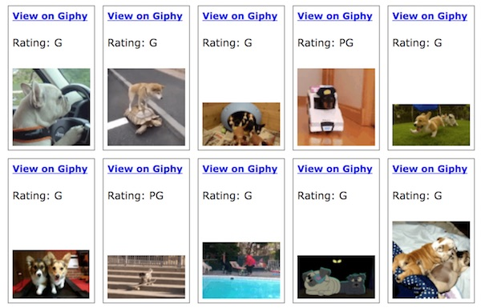

#### B. Cleaned up HTML page, with CSS and JS kept in separate files
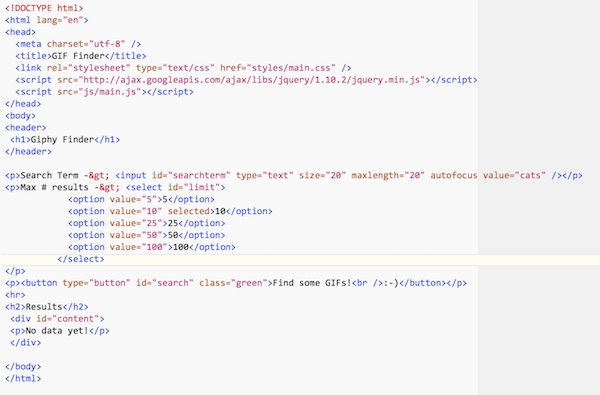

#### C. Better page design
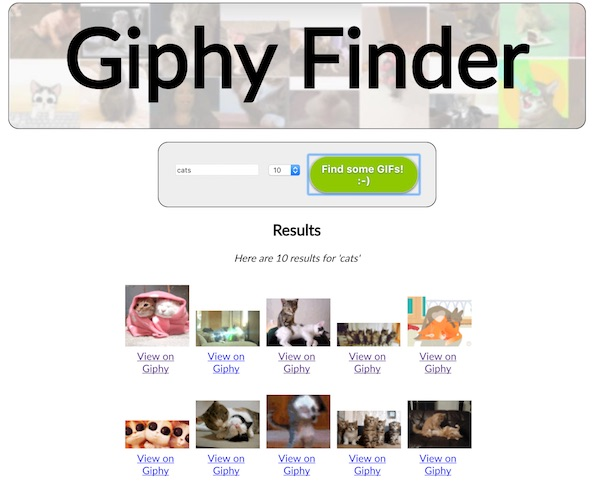


<hr><hr>

**[Table of Contents <- About this Web App Tutorial Series](web-apps-0.md)**
