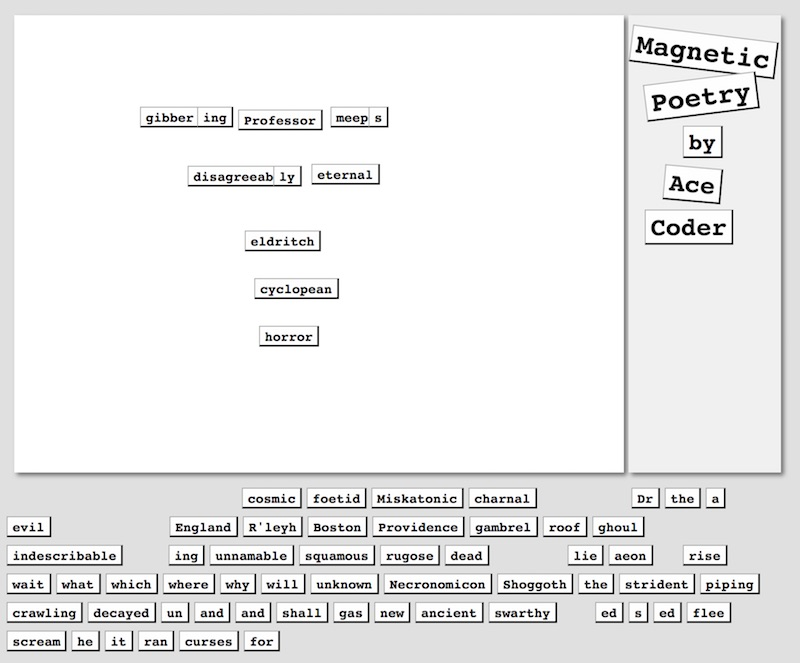
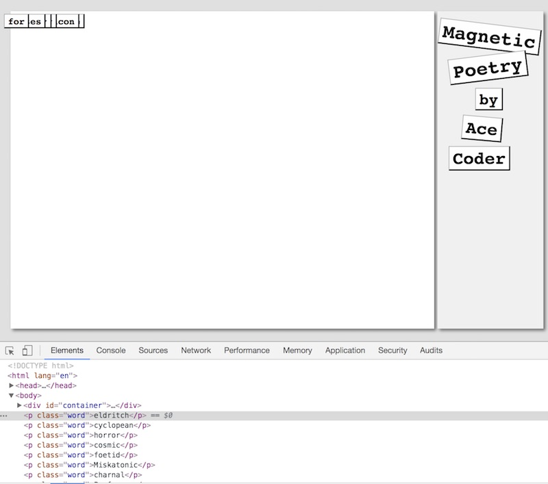
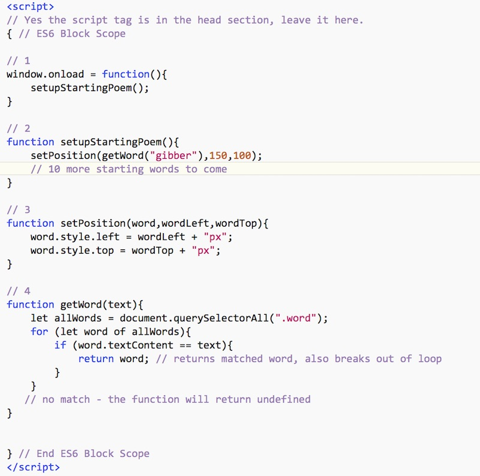
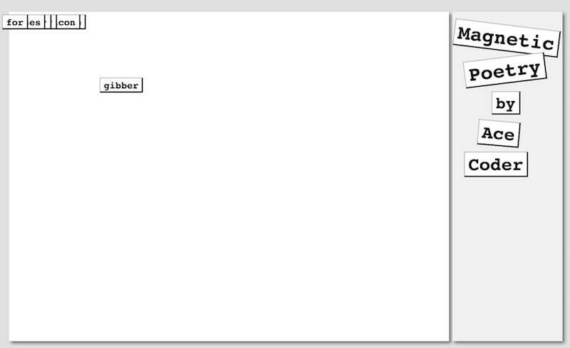
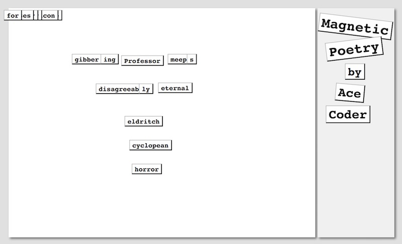
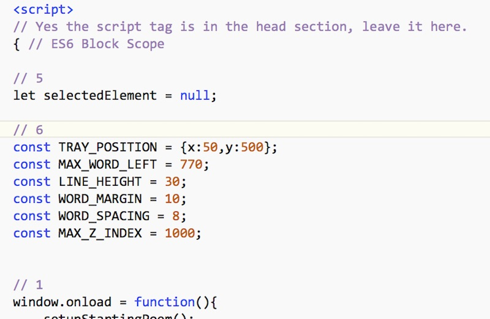
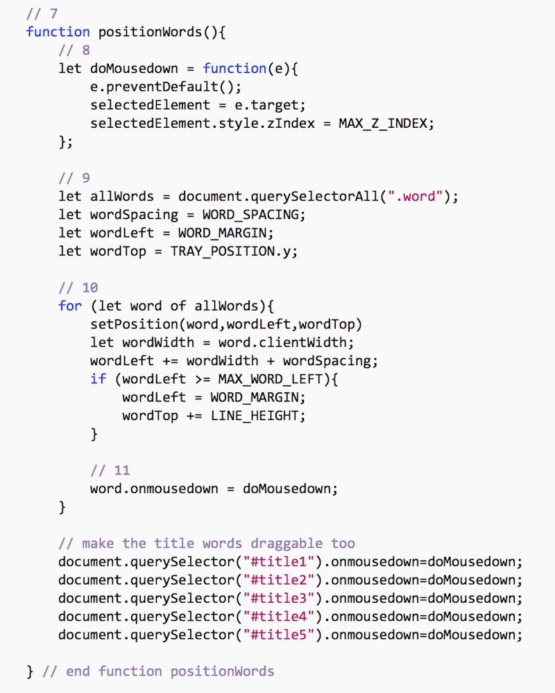
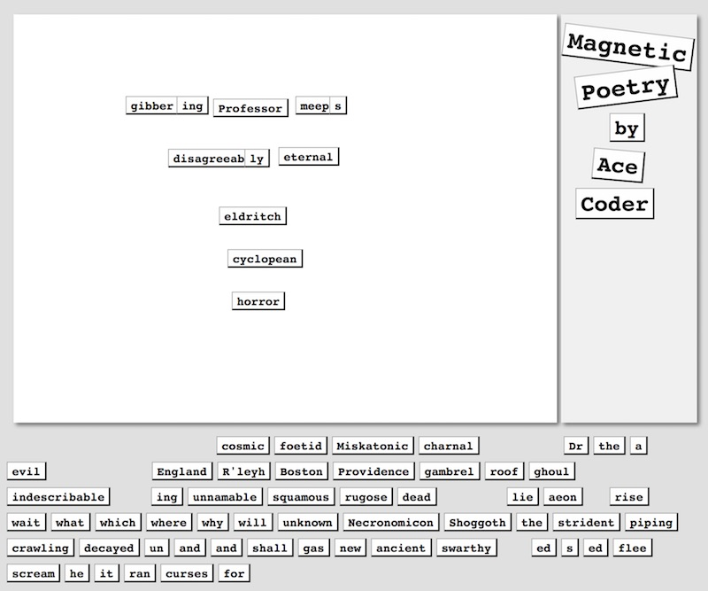
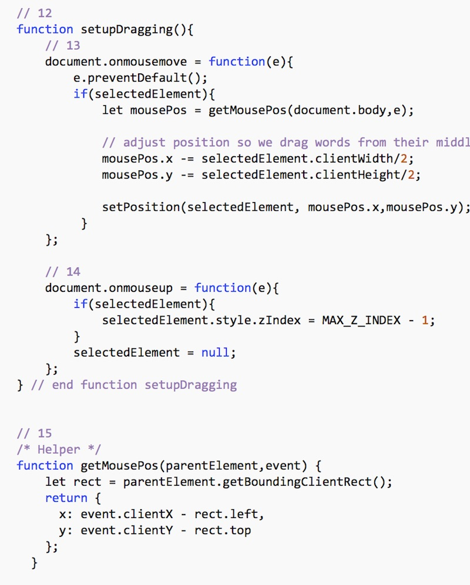

# Homework: Magnetic Poetry

## Overview
- In this assignment you will create a "magnetic poetry" application that allows the user to reposition words on the screen to create their own poems.
- This assignment uses a lot of the CSS we have seen this semester including *CSS transforms* and *absolute positioning*.
- The completed assignment will also utilize some new mouse events (for us) including `mousedown`, `mouseup`, and `mousemove`. 
- To do this assignment, you should have completed at least the [7th web app tutorial page - "JavaScript Object Literals"](./web-apps-7.md).
- Below is what the completed version will look like: 



## Instructions


### I. Get Started
Here is the HTML & CSS to get you started - go ahead and create **word-magnets.html** :

#### word-magnets.html

```html
<!DOCTYPE html>
<html lang="en">
<head>
	<meta charset="utf-8" />
    <title>Word Magnets</title>
    <style>
    	body{
    		background-color: #e0e0e0;
    	}
    	
    	#container{
    		width:815px;
    	}
    	
		#fridge{
			background: #ffffff;
			cursor: pointer;
			margin-left: 10px;
			margin-top: 10px;
			box-shadow: 3px 3px 6px rgba(0,0,0,0.5);
			width:640px;
			height:480px;
			float:left;
		}
		
		#sidebar{
			background: #f0f0f0;
			float:left;
			width:160px;
			height:480px;
			margin-top: 10px;
			margin-left:5px;
			box-shadow: 3px 3px 6px rgba(0,0,0,0.5);
		}
		
		.word,.titleWord{
			position:absolute;
			font-size:14px;
			font-weight:bold;
			font-family:courier,monospaced;
			border: 1px solid #aaa;
    		border-bottom: 2px solid #222;
    		border-right: 2px solid #222;
			background-color: #fefefe;
			padding:2px 5px 1px 5px;
			cursor:move;
		}
		
		/* Our Title Words */
		#title1{
			top:8px;
			left:665px;
			font-size:22pt;
			transform: rotate(7deg);
		}
		
		#title2{
			top:55px;
			left:680px;
			font-size:22pt;
			transform: rotate(-7deg);
		}
		
		#title3{
			top:110px;
			left:720px;
			font-size:18pt;
		}
		
		#title4{
			top:150px;
			left:700px;
			font-size:20pt;
			transform: rotate(5deg);
		}
		
		#title5{
			top:195px;
			left:680px;
			font-size:20pt;
		}
		
 	</style>
 	<script>
 	// Yes the script tag is in the head section, leave it here.
 	
 	{ // ES6 Block Scope
 	

 	
 	} // End ES6 Block Scope
 	</script>
</head>
<body>
	<div id="container">
    	<div id="fridge"></div>
    	<div id="sidebar">
    		<p class="titleWord" id="title1">Magnetic</p>
    		<p class="titleWord" id="title2">Poetry</p>
    		<p class="titleWord" id="title3">by</p>
    		<p class="titleWord" id="title4">Ace</p>
    		<p class="titleWord" id="title5">Coder</p>
    		
    	</div>
    </div>
   	<p class="word">eldritch</p>
    <p class="word">cyclopean</p>
    <p class="word">horror</p>
    <p class="word">cosmic</p>
    <p class="word">foetid</p>
    <p class="word">Miskatonic</p>
    <p class="word">charnal</p>
    <p class="word">Professor</p>
    <p class="word">Dr</p>
    <p class="word">the</p>
    <p class="word">a</p>
    <p class="word">evil</p>
    <p class="word">disagreeable</p>
    <p class="word">England</p>
    <p class="word">R'leyh</p>
    <p class="word">Boston</p>
    <p class="word">Providence</p>
    <p class="word">gambrel</p>
    <p class="word">roof</p>
    <p class="word">ghoul</p>
    <p class="word">gibber</p>
    <p class="word">meep</p>
    <p class="word">indescribable</p>
    <p class="word">ing</p>
    <p class="word">ing</p>
    <p class="word">unnamable</p>
    <p class="word">squamous</p>
    <p class="word">rugose</p>
    <p class="word">dead</p>
    <p class="word">eternal</p>
    <p class="word">lie</p>
    <p class="word">aeon</p>
    <p class="word">s</p>
    <p class="word">rise</p>
    <p class="word">wait</p>
    <p class="word">what</p>
    <p class="word">which</p>
    <p class="word">where</p>
    <p class="word">why</p>
    <p class="word">will</p>
    <p class="word">unknown</p>
    <p class="word">Necronomicon</p>
    <p class="word">Shoggoth</p>
    <p class="word">the</p>
    <p class="word">strident</p>
    <p class="word">piping</p>
    <p class="word">crawling</p>
    <p class="word">decayed</p>
    <p class="word">un</p>
    <p class="word">and</p>
    <p class="word">and</p>
    <p class="word">shall</p>
    <p class="word">gas</p>
    <p class="word">new</p>
    <p class="word">ancient</p>
    <p class="word">swarthy</p>
    <p class="word">ly</p>
    <p class="word">ed</p>
    <p class="word">s</p>
    <p class="word">ed</p>
    <p class="word">flee</p>
    <p class="word">scream</p>
    <p class="word">he</p>
    <p class="word">it</p>
    <p class="word">ran</p>
    <p class="word">curses</p>
    <p class="word">for</p>
</body>
</html>
```

This initial state of the app looks like this:



- In the web inspector you will notice that the words are contained in &lt;p> tags with the class of "word". 
- You should also notice that the words are stacked on top of each other. This is because they currently have `position: absolute`, and because the `top` and `left` were never specified, the words are at "0,0" - the top-left corner of the screen.

### II. Looking at the structure of the page
Yes, there are a lot of lines here, but we'll start to clean this up soon.

Now we will we do a quick walkthrough of the code:

1. the body has a dark gray background.
1. we have a `#container` division. The sole purpose of this div is to size this app at 815 pixels wide. It will be a little over 480-pixels high because of its 2 children divs below.
1. the `#fridge` division is 640x480, and has a white background and drop shadow, and is where the user will place their magnets.
1. the `#sidebar` division is 160x480, and has a light gray background, and is where the `#title1`, `#title2` etc "tiles" are placed.
1. The words are actually going to be placed beneath the `#container` are currently children of the &lt;body> tag.

### III. Change the title "tiles" and move the CSS to an external file
1. Currently  `#title4` and `#title5` read "Ace" and "Coder". Go ahead and change these to your name, or a truncated version of your name.
1. You will likely need to change the position and rotation and font-size of these tiles to keep the layout looking nice, so go ahead and modify CSS rules as necessary.
1. Feel free to modify the overall color scheme to something more appealing - either now or when you have completed the exercise.
1. Also feel free to come up with your own word set - there are PDFs of word sets on this site: https://magneticpoetry.com
1. Once you are happy with your CSS changes, move the CSS rules to an external file named **styles.css**. This will partially "clean up" your HTML file. Reminder: You NEVER put &lt;style> tags in an external style sheet.

### IV. Start Coding
1. You should have noticed that the &lt;script> tag is located in the &lt;head> section. We are going to leave it there, and then hook into the `window.onload` event to be sure that our DOM manipulation code fires *after* the page has loaded.
1. You should also have noticed that we have wrapped all of our code in a set of curly braces marked "ES6 Block Scope". This is a small change from the default "Script Scope" we have been using, but it will ensure that no code located in other (future) script files can impact our existing JavaScript code.
1. We are going to use event handlers and regular functions throughout this exercise. Alternatively, you could certainly use event listeners and arrow functions if you so desired.
1. Go ahead and type the following code in:



**What - it's an image - no copy/paste!?**

Don't worry, we'll give you some copy/paste opportunities later.

#### A. Explanation
- #1 above - we give the `window.onload` event handler an anonymous function to call once the window is loaded. This will not happen until after the page has loaded.
- #2 above - the `setStartingPoem()` function will call `setPosition()` on the 11 words that are in our starting poem (we are only calling it on the word "gibber" as of now).
- #3 above - the `setPosition()` function is for positioning words, this will later be called from several places in our code. Whenever you have duplicate lines of code, you need to strongly consider factoring it out into its own function or method.
- #4 above - the `getWord()` function grabs all of the elements on the page with an `id` of `word`, and then loops through them looking for a match. A limitation of this method is that it will grab the first word of that name it finds, so if you have two words with the same text, the second will be ignored. To avoid the looping, ideally there would have been a CSS selector that allowed you to match elements based on their text, but that was taken out of the HTML5 specification. FUN FACT: jQuery has the `.contains(text)` method that does just that, but behind the scenes, there is no doubt looping going on.

**Go ahead and open your page in Chrome, it should look like this ("gibber" has now moved off of the stack of words in the corner) - if it doesn't, check the JavaScript console:**




#### B. More starting words

Here is some code you can copy and paste into `setStartingPoem()`. This will position all 11 of the starting words.


```javascript
setPosition(getWord("gibber"),150,100);
setPosition(getWord("ing"),210,100);
setPosition(getWord("Professor"),253,103);
setPosition(getWord("meep"),350,100);
setPosition(getWord("s"),390,100);

setPosition(getWord("disagreeable"),200,162);
setPosition(getWord("ly"),290,162);
setPosition(getWord("eternal"),330,160);

setPosition(getWord("eldritch"),260,230);
setPosition(getWord("cyclopean"),270,280);
setPosition(getWord("horror"),275,330);
```

**Reload the browser - it should now look like this:**



### V. More Coding

Next you can add a block variable, and some constants that we will need soon. Put these at the very top of your main block (right after the first opening curly brace).



**Go ahead and reload the page, it should look the same. Check the JavaScript console to be absolutely sure there are no errors.**

#### A. Explanation
- #5 above - we will be using the `selectedElement` variable soon to keep a reference to whatever word the user is currently attempting to drag.
- #6 above - these are some useful constants we will need when we start positioning elements on the screen.


### VI. Getting the words organized

Right now most of the word are still stuck in the upper-left corner of the screen, lets fix that by laying them out in the "word tray" located just under the `#fridge`.
- First, call the `positionWords()` function at the top of the `window.onload` callback function.
- Second, here's your code:



**Reload the page - all the words should be nicely arranged now. Dragging is not working yet.**



#### A. Explanation
- #7 above - the purpose of `positionWords()` is to lay out the words neatly at the bottom of the screen, and to set up the `mousedown` handlers that we will soon need.
- #8 above - you can see that the `mousedown` event handler pops the word on top of all other words, and assigns it to `selectedElement`. `e.preventDefault` is also interesting - it prevents any default behavior of the mouse down from happening, selecting text or showing tool tips for example. If this was a hypertext link then `preventDefault()` would kill that too.
- #9 above - grabs all of the `class=word` elements on the screen.
- #10 above - this is our code for positioning the words evenly.
- #11 above - we assign the `mousedown` handler, which doesn't do much yet.

**Important - if your browser is having trouble seeing some of your block variables like `WORD_SPACING` etc, it could be a browser bug (Safari 11 seems to have this issue). To fix it, just delete the 2 top-level braces and put your whole app back into *Script Scope*, that seems to fix the issue on Safari.**

### VII. Getting word dragging working
We are almost done - we just need to get the word dragging working by adding support for `mousemove` and `mouseup`. We previously put the `mousedown` handler on each word, but with these next two mouse methods, we need to attach them to the entire document, which makes 100% sense if you think about it for a little while (especially for `mousemove`).
- First, call the `setupDragging()` function at the bottom of the `window.onload` callback function.
- Second, here's your code:



**Reload the page - all the words should be nicely arranged as before. Dragging should now work.**

#### A. Explanation
- #12 above - `setupDragging()` is adding mouse events to the document so that the user can drag words around 
- #13 above - in `document.onmousemove` we drag the word to the position of the mouse, and have to adjust our coordinates so that we always drag from the middle of the word, not the edge. Note that the **move cursor** that appears when we mouse over the words is done by our CSS.
- #14 above - in `document.onmouseup` we clear out `selectedElement`, and make sure that the word we just selected is not at the highest z-index.
- #15 above - in our `getMousePos()` helper function we are merely translating the window coordinates we get from the event handler to the equivalent `#fridge` coordinates. This just means we subtract the left and top values of `#fridge` from the numbers we get from the mouse event. **Example:** 10,10 in window coordinates is roughly 0,0 in `#fridge` coordinates.

### Submission
- That's enough. We're not going to make you do anything else to this, congratulations on your typing acumen!
- Put **word-magnets.html** and **styles.css** in the same folder, and ZIP it. Then post to to the dropbox.

### Enhancements
There is quite a bit you could do with this app to make it a potential portfolio piece. Here are a few ideas:
- load words from array and dynamically create the magnets
- reset board to its starting state
- get more words in the same set and clear out the existing unused words
- load new word sets with a &lt;select>
- change background image
- images as words
- save poetry (in # of URL)
- share URL
- slightly rotated words so they look more realistic (CSS transform/rotation)
- deleting words
- modifying the style of selected words
- users can add words

<hr><hr>

**[Table of Contents <- About this Web App Tutorial Series](web-apps-0.md)**
