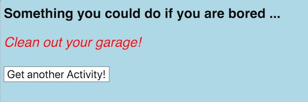

# Random Activity - Utilizing a Web Service with PHP

## I. Overview
- Later on in the course we will learn about using JavaScript to download web services (and here are the notes - [Web Apps-10](notes/web-apps-10.md) - if you are interested)
- Today we'll give you a brief preview of how to download and parse a web service using PHP. The web service we will use is a simple one called the [Bored API](https://www.boredapi.com) - this API returns a random activity (in **JSON** format) every time it is called 
- This is what we will be building:



- Clicking the button causes the PHP page to reload, and the PHP script to request another activity from the web service
- This is similar to what our PHP contact form did, but in this case we are not passing any additional information to the PHP script

## II. Get Started

Here's the starter code:

**random-activity.php**

```php
<!DOCTYPE html>
<html lang="en">
<head>
	<meta charset="utf-8" />
	<title>Random Activity!</title>
	<style>
		body{
			font-family: sans-serif;
			background-color: lightblue;
		}
		p{
			color: red;
			font-size: 2em;
			font-style: italic;
		}
		input[type="submit"]{
			font-size:20pt;
			border:1px groove gray;
			margin-top:1.5em;
			display:block;
		}
	</style>
</head>
<body>
   <h1>Something you could do if you are bored ...</h1>

   <!-- PHP will start here -->

   <!-- PHP will end here -->
	
   <form action="random-activity.php" method="post">
      <input type="submit" value="Get another Activity!">
   </form>
</body>
</html>
```

- If you create this page and post it to a web server, you'll see the page title and the button, but no "activity text"
- Clicking the button reloads the page, but nothing else happens

## III. Finish it up

**Let's write the PHP code that downloads the data from the web service - add the following the the file:**

```php
<!-- PHP will start here -->
<?php
	// 1- the web service documentation
	// https://www.boredapi.com/about

	// 2 - URL to the web service's main entry point
	$serviceURL = 'http://boredapi.com/api/activity/';

	// 3 - Fetch the JSON file and store it as a string
	// http://php.net/manual/en/function.file-get-contents.php
	$json =  file_get_contents($serviceURL);
	
	// 4 - convert the JSON string to a PHP object
	// http://php.net/manual/en/function.json-decode.php
	$obj = json_decode($json); 
	
	// 5 - grab the value of the .activity property
	// $obj is an object that contains all of the properties we got back from the web service
	// in PHP we use arrow syntax to access properties of an object
	$activity =  $obj->activity; 
	
	// 6 - echo it out!
	echo "<p>$activity!</p>";
?>
<!-- PHP will end here -->
```

- to learn how this code works, read the comments above, and check out the documentation
- go ahead and click the Submit button on the page, it should reload the page, which will then download and display the activity

## IV. Dicussion

- That was pretty easy, it really was. And you will eventually see that downloading web services on the *client-side* using JavaScript is a little more involved
- For a challenge, create a new PHP acript named **random-joke.php** and try using this [Chuck Norris Web Service](http://www.icndb.com/api/) to instead download a random joke
- Another challenge would to switch back to the [Bored API](https://www.boredapi.com/about), and add a form field that would allow the user to specify different types of activities - there are 7 different types:
"education", "recreational", "social", "diy", "charity", "cooking", "relaxation", "music", and "busywork". See the Bored API docs about how to do this
